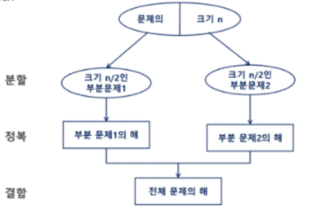
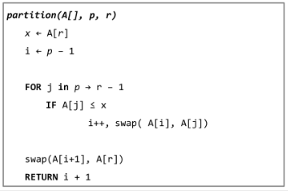

# 분할정복 & 백트래킹
## INDEX
>   - 분할정복
>   - 퀵 정렬
>   - 이진 검색
>   - 백트래킹
>   - 트리
---
## 학습목표
> - 문제를 분할해서 해결하는 분할 정복(Divide and Conquer) 기법을 이해하고 대표적인 알고리즘인 퀵 정렬과 병합 정렬에 대해 학습한다.
> - 상태공간 트리의 모든 노드를 검색하는 백트래킹에 대해 학습한다.
> - 이진 트리(Binary Tree)의 특성을 이해하고 이진 트리의 중요한 연산인 탐색, 삽입, 삭제 알고리즘을 학습한다.
---
## 문제 제시 : 가짜 동전 찾기
- n 개의 동전들 중에 가짜 동전이 하나 포함되어 있다. 가짜 동전은 진짜 동전에 비해 아주 조금 가볍다. 진짜 동전들의 무게가 동일하다고 할 때 양팔 저울을 이용해서 가짜 동전은 찾아보자.
- 양팔 저을을 최소로 사용해서 가짜 동전을 찾는 방법은 무엇인가?
- 예를 들어 동전이 24(진짜23, 가짜1)개 있다면?
---
## 분할 정복
>**분할 정복 기법**
>   - 유래
>       - 1805년 12월 2일 아우스터리츠 전투에서 나폴레옹ㅇ이 사용한 전략
>       - 전력이 우세한 연합군을 공격하기 위해 나폴레옹은 연합군의 중앙부로 쳐들어가 연합군을 둘로 나눔.
>       - 둘로 나뉜 연합군을 한 부분씩 격파함
>
>   - 설계 전략
>       - 분할(Divide) : 해결할 문제를 여러 개의 작은 부분으로 나눈다.
>       - 정복(Conquer) : 나눈 작은 문제를 각각 해결한다.
>       - 통합(Combine) : (필요하다면) 해결된 해답을 모은다.
>   
>
>   - Top-donw approach
>       

>**거듭 제곱**
>   - 반복(Iterative) 알고리즘:O(n)
>       
>       ```python
>       def iterative_Power(x, n):
>           result = 1
>           for i in range(1, n):
>               result *= x
>           return result
>       ```
>   
>   - 분할 정복 기반의 알고리즘: O(log(N))
>       
>       ```python
>       def Recursive_Power(x, n):
>           if n == 1 :
>               return x
>           if n % 2 == 0:
>               y = Recursive_Power(x, n/2)
>               return y*y
>           else:
>               y = Recursive_Power(x, (n-1)/2)
>               return y*y*x
>       ```

>**병합 정렬(Merge Sort)**
> - 여러 개의 정렬된 자료의 집합을 병합하여 한 개의 정렬된 집합으로 만드는 방식
> - 분할 정복 알고리즘 활용
>   - 자료를 최소 단위의 문제까지 나눈 후에 차례대로 정렬하여 최종 결과를 얻어냄.
> - 시간 복잡도
>   - O(n*log(n))
> - 병합 정렬 과정
>   - {69, 10, 30, 2, 16, 8, 31, 22}를 병합 정렬하는 과정
>   - 분할 단계 : 전체 자료 집합에 대하여, 최소 크기의 부분집합이 될 때까지 분할 작업을 계속한다.
>   
>   - 병합 단계 : 2개의 부분집합을 정렬하면서 하나의 집합으로 병합
>       - 8개의 부분 집합이 1개로 병합될 때가지 반복함
>  
>       
>   
>- 알고리즘
>   - 분할 과정
>       
>   
>   - 병합 과정
>       
>   
>   - 코드
>       ```python
>       # 분할 과정
>       def merge_sort(m: list):
>           if len(m) == 1:
>               return m
>           left = []
>           right = []
>           mid = len(m)//2
>           for i in range(mid):
>               left.append(m[i])
>           for i in range(mid, len(m)):
>               right.append(m[i])
>       
>           left = merge_sort(left)
>           right = merge_sort(right)
>       
>           return merge(left, right)
>       
>       # 병합 과정
>       def merge(left:list, right:list):
>           result = []
>           len_left = len(left)
>           len_right = len(right)
>           idx_left = 0
>           idx_right = 0
>           while idx_left < len_left and idx_right < len_right:
>               if left[idx_left] < right[idx_right]:
>                   result.append(left[idx_left])
>                   idx_left += 1
>               else:
>                   result.append(right[idx_right])
>                   idx_right += 1
>           while idx_left < len_left:
>               result.append(left[idx_left])
>               idx_left += 1
>           while idx_right < len_right:
>               result.append(right[idx_right])
>               idx_right += 1
>           return result
>       
>       
>       arr = [69, 10, 30, 2, 16, 8, 31, 22]
>       print(merge_sort(arr))
>        ```
---
## 퀵 정렬
> **퀵 정렬**
> - 주어진 배열을 두 개로 분할하고, 각각을 정렬한다.
>   - 병합 정렬과 동일?
> - 다른점
>   - 병합 정렬은 그냥 두 부분으로 나누는 반면에, 퀵 정렬은 분할 할 때, 기준 아이템(pivot item) 중심으로, 이보다 작은 것은 왼편, 큰 것은 오른편에 위치시킨다.
>   - 각 부분 정렬이 끝난 후, 병합정렬은 "병합"이란 후처리 작입이 필요하나, 퀵 정렬은 필요로 하지 않는다.
> - 알고리즘
>   
>   
>
> - Hoare-Partition 알고리즘
>   
>   
>
> - 아이디어
>   - p(피봇) 값들 보다 큰 값은 오른쪽, 작은 값은 왼쪽 집합에 위치하도록 한다.
>   
>       
>
>   - 피봇을 두 집합의 가운데에 위치시킨다.
>
>       
>
> - 피봇 선택
>   - 왼쪽 끝/ 오른쪽 끝/ 임의의 세개 값 중에 중간 값
>
>       
>       
>       
>
>       
>
>       
>       
>       
>
>       
>
> - Lomuto partition 알고리즘
>   
>    
---
## 이진검색
> **문제 제시 : 병두껑 속의 숫자 게임**
> - 술래가 병뚜껑 속 숫자를 확인한 후, 다음 사람부터 숫자를 맞히기 시작한다. 술래은 Up 또는 Down을 통해 게임에 참여한 사람들이 병뚜껑 속 숫자에 점점 가까워질 수 있도록 힌트를 제시한다.
> - 예시 : 병뚜껑 속 숫자가 3일 경우
>   - 첫 번째 사람이 14를 외쳤다면!
>   - 술래는 'DOWN'!
>   - 두 번째 사람이 2를 외쳤다면!
>   - 술래는 'UP'!
>   - 세 번째 사람이 4를 외쳤다면!
>   - 술래는 'DOWN'!
>   - 네 번째 사람이 병뚜껑 속 숫자인 3을 부를 수 밖에 없으므로 벌수 당첨!
> - 이 게임은 숫자를 맞히는 게 아니라 피하는게 핵심!
> - 최대로 빨리 당첨 되려면 어떻게 하면 될까?
---
> **이진 검색(Binary Search)**
> - 자료의 가운데에 있는 항목의 키 값과 비교하여 다음 검색의 위치를 결정하고 검색을 계속 진행하는 방법
>   - 목적 키를 찾을 때까지 이진 검색을 순환적으로 반복 수행함으로써 검색 범위를 반으로 줄여가면서 보다 빠르게 검색을 수행함
> - 이진 검색을 하기 위해서는 자료가 정렬된 상태여야 한다.
>
> - 검색 과정
>
>   1. 자료의 중앙에 있는 원소를 고른다.
>   2. 중앙 원소의 값과 찾고자 하는 목표 값을 비교한다.
>   3. 목표 값이 중앙 원소의 값보다 작으면 자료의 왼쪽 반에 대해서 새로 검색을 수행하고, 크다면 자료의 오른쪽 반에 대해서 새로검색을 수행한다.
>   4. 찾고자 하는 값을 찾을 때까지 위의 과정을 반복한다.
>
> - 예시
>   1. 이진 검색으로 7을 찾는 경우
>
>       
>
>   2. 이진 검색으로 20을 찾는 경우
>
>       
>
> - 알고리즘 : 반복구조
>
>   
>
> - 알고리즘 : 재귀구조
>
>   

>**분할 정복의 활용**
> - 병합 정렬은 외부 정렬의 기본이 되는 알고리즘이다. 또한, 멀티코어(Multi-Core)CPU 나 다수의 프로세서에서 정렬 알고리즘을 병렬화하기 위해 병합 정렬 알고리즘이 활용된다.
> - 퀵 정렬은 매우 큰 입력 데이터에 대해서 좋은 성능을 보이는 알고리즘이다.
---
### <연습문제1>
>**<연습문제1>**
> - 배열의 데이터를 퀵 정렬하는 함수를 작성하고 테스트 해보시오
> - 입력 예
>   - 11 45 23 81 28 34
>   - 11 45 22 81 23 34 99 22 17 8
>   - 1 1 1 1 1 0 0 0 0 0
>
> - 코드
>   ```python
>   def partition(A:list, l, r):
>       p = A[l]
>       i = l
>       j = r
>       while i <= j:
>           while i <= j and A[i] <= p:
>               i += 1
>           while i <= j and A[j] >= p:
>               j -= 1
>           if i < j:
>               A[i], A[j] = A[j], A[i]
>       A[l], A[j] = A[j], A[l]
>       return j
>   
>   
>   def quickSort(A:list, l, r):
>       if l < r:
>           s = partition(A, l, r)
>           quickSort(A, l, s-1)
>           quickSort(A, s+1, r)
>   
>   
>   arr = list(map(int, input().split()))
>   quickSort(arr, 0, len(arr)-1)
>   print(arr)
>   
>   '''
>   input:
>   11 45 23 81 28 34
>   11 45 22 81 23 34 99 22 17 8
>   1 1 1 1 1 0 0 0 0 0
>   '''
>   
>   '''
>   output:
>   [11, 23, 28, 34, 45, 81]
>   [8, 11, 17, 22, 22, 23, 34, 45, 81, 99]
>   [0, 0, 0, 0, 0, 1, 1, 1, 1, 1]
>   '''
>   ```
---
## 백트래킹
> **문제 제시 : N-Queen 문제**
> - n x n 체스판에 배치한 Queen들이 서로 위협하지 않도록 n개의 Queen을 배치하는 문제
>   - 어떤 두 Queen도 서로 위협하지 않아야 한다.
>   - Queen을 배치한 n개의 위치는?

> **백트래킹(Backtracking) 개념**
> - 여러 가지 선택지(옵션)들이 존재하는 상황에서 한 가지를 선택한다.
> - 선택이 이루어지면 새로운 선택지들의 집합이 생성된다.
> - 이런 선택을 반복하면서 최종 상태에 도달한다.
>   - 올바른 선택을 계속하면 목표 상태(goal state)에 도달한다.
>
>
> - 당첨 리프 노드 찾기
>   - 루트에서 갈 수 있는 노드를 선택한다.
>   - 꽝 노드까지 도달하면 최근의 선택으로 되돌아와서 다시 시작한다.
>   - 더 이상의 선택지가 없다면 이전의 선택지로 돌아가서 다른 선택을 한다. 
>   - 루트까지 돌아갔을 경우 더 이상 선택지가 없다면 찾는 답이 없다.
>
>   
>
>
> - 백트래킹과 깊이 우선 탐색과의 차이
>   - 어떤 노드에서 출발하는 경로가 해결책으로 이어질 것 같지 않으면 더이상 그 경로를 따라가지 않음으로써 시도의 횟수를 줄임. (**Prunning: 가지치기**)
>   - 깊이 우선 탐색이 모든 경로를 추적하는데 비해 백트래킹은 불필요한 경로를 조기에 차단.
>   - 깊이 우선 탐색을 가하기에는 경우의 수가 너무나 많음. 즉 **N!** 가지의 경우의 수를 가진 문제에 대해 깊이 우선 탐색을 가하면 당연히 처리 불가능한 문제.
>   - <u>백트래킹 알고리즘을 적용하면 일반적으로 경우의 수가 줄어들지만 이 역시 최악의 경우에는 여전히 지수함수 시간(Exponential Time)을 요하므로 처리 불가능</u>
>
>
> - 8-Queens 문제
>   - 퀸 8개을 8x8 크기의 체스판 안에 서로를 공격할 수 없도록 배치하는 모든 경우를 구하는 문제
>   - 후보 해의 수 : 64!/((8!)*((64-8)!)) = 4,426,165,368
>   - 실제 해의 수 : 이 중에서 실제 해는 92개뿐
>   - 즉, 44억 개가 넘는 후보 해의 수 속에서 92개를 최대한 효율적으로 찾아내는 것이 관건
>   - 4-Queens 문제로 축소해서 생각해 보자
>       - 같은 행에 위치할 수 없다.
>       - 모든 경우의 수 : 4x4x4x4 = 256
>       
>       
>
>       - 루트 노드에서 리프(leaf) 노드까지의 경로는 해답후보(candidate solution)가 되는데, 깊이 우선 검색을 하여 그 해답후보 중에서 해답을 찾을 수 있다.
>       - 그러나 이 방법을 사용하면 해답이 될 가능성이 전혀 없는 노드의 후손 노드(descendant)들도 모두 검색해야 하므로 비효율 적이다.
>- 모든 후보를 검사?
>   - NO!
>- 백트래킹 기법
>   - 어떤 노드의 유망성을 점검한 후에 유망(promising)하지 않다고 결정되면 그 노드의 부모로 되돌아가(backtracking) 다음 자식 노드로 감.
>   - 어떤 노드를 방문하였을 때 그 노드를 포함한 경로가 해답이 될 수 없으면 그 노드는 유망하지 않다고 하며, 반대로 해답의 가능성이 있으면 유망하다고 한다.
>   - 가지치기(prunning) : 유망하지 않는 노드가 포함되는 경로는 더이상 고려하지 않는다.
>
> - 백 트래킹을 이용한 알고리즘은 다음과 같은 절차로 진행된다.
>   1. 상태 공간 트리의 깊이 우선 검색을 실시한다.
>   2. 각 노드가 유망하지를 점검한다.
>   3. 만일 그 노드가 유망하지 않으면, 그 노드의 부모 노드로 돌아가서 검색을 계속한다.
> - 일반 백트래킹 알고리즘
>
>   
>
>   
>
> - 상태 공간 트리
>
>   
>
> - 깊이 우선 검색 vs 백트래킹
>   - 순수한 깊이 우선 검색 = 155노드
>   - 백트래킹 = 27노드

> **상태공간트리를 구축하여 문제를 해결**
> - psuedo code
>   
>   
>
> - {1, 2, 3}의 powerset을 구하는 백트래킹 알고리즘
>   
>   
>
>   
>
>   
>
> - 백트래킹을 이용하여 순열 구하기
>   - 접근 방법은 앞의 부분집합 구하는 방법과 유사하다.
>
>   
>
>   
>
>   
---
### <연습문제2>
> **<연습문제2>**
> - {1, 2, 3, 4, 5, 6, 7, 8, 9, 10}의 powerset중 원소의 합이 10인 부분 집합을 모두 출력하시오.
>   ```python
>   def f(k, sum_v, res_arr):
>       if k == len_arr:
>           if sum_v == 10:
>               print(res_arr)
>       else:
>           f(k+1, sum_v, res_arr)
>           if arr[k] + sum_v <= 10:
>               f(k+1, sum_v+arr[k], res_arr+[arr[k]])
>   
>   
>   arr = [1, 2, 3, 4, 5, 6, 7, 8, 9, 10]
>   len_arr = len(arr)
>   f(0, 0, [])
>   
>   """
>   [10]
>   [4, 6]
>   [3, 7]
>   [2, 8]
>   [2, 3, 5]
>   [1, 9]
>   [1, 4, 5]
>   [1, 3, 6]
>   [1, 2, 7]
>   [1, 2, 3, 4]
>   """
>   ```
---
## 트리
> **문제 제시 : 계산기**
> - 수식 2 + 3 * 4 를 다음과 같은 그래프로 표현하고 그래프를 순회하여 수식을 계산하시오.
>
>   

> **트리(Tree)**
> - 트리는 싸이클이 없는 무향 연결 그래프이다.
>   - 두 노드(or 정점) 사이에는 유일한 경로가 존재한다.
>   - 각 노드는 최대 하나의 부모 노드가 존재할 수 있다.
>   - 각 노드는 자식 노드가 없거나 하나 이상이 존재할 수 있다.
> - 비선형 구조
>   - 원소들 간에 1:n 관계를 가지는 자료구조
>   - 원소들 간에 계층 관계를 가지는 계층형 자료구조
>
>   