# 그래프 & 백트래킹
---
## INDEX
> **INDEX**
>   - 그래프 기본
>   - DFS
>   - BFS
>   - 서로소 집합들
>   - 최소 비용 신장 트리 (MST)
>   - 최단 경로
---
## 학습목표
> **학습목표**
> - 실 세계 문제를 그래프로 추상화해서 해결하는 방법을 학습한다.
>   - 그래프 탐색 기법인 BFS와 DFS에 대해 학습한다.
>   - 그래프 알고리즘에 활용되는 상호베타 집합(Disjoint-Set)의 자료구조에 대해 학습한다.
>   - 최소 신장 트리(Minimum Spanning Tree)를 이해하고 탐욕 기법을 이용해서 그래프에서 최소 신장 트리를 찾는 알고리즘을 학습한다.
>   - 그래프의 두 정점 사이의 최단 경로(Shortest Path)를 찾는 방법을 학습한다.
---
## 그래프 기본
> **문제 제시 : 친구 관계**
> - A의 친구는 B다.
> - C의 친구는 E, F이다.
> - (D-E), (F-G), (N-B, I, L), (G-A, C, D, H), (I-J, H), (B-D, K, L), (M-I, J), (E-A, H), (C-B, I, L), (B-I), (J-A, G)
> - A의 친구 중에서 친구가 가장 많은 친구는 누구인가?

>**그래프**
> - 그래프는 아이템 (사물 또는 추상적 개념)들과 이들 사이의 연결 관계를 표현한다.
> - 그래프는 정점(Vertex)들의 집합과 이들을 연결하는 간선(Edge)들의 집합으로 구성된 자료 구조
>   - V : 정점의 개수, E : 그래프에 포함된 간선의 개수
>   - V개의 정점을 가지는 그래프는 최대V(V-1)/2 간선이 가능
>
>      예) 5개 정점이 있는 그래프의 최대 간선수는 10(=5*4/2)개이다.
> - 선형 자료구조나 트리 자료구조로 표현하기 어려운 N : N 관계를 가지는 원소들을 표현하기에 용이하다.

> **그래프 유형**
> - 무향 그래프(Undirected Graph)
> - 유향 그래프(Directed Graph)
> - 가중치 그래프(Weighted Graph)
> - 사이클 없는 방향 그래프(DAG, Directed Acyclic Graph)
>
>   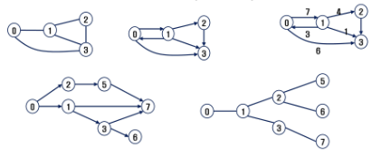
>
> - 완전 그래프
>   - 정점들에 대해 가능한 모든 간선들을 가진 그래프
>
>       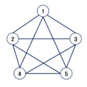
>
> - 부분 그래프
>   - 원래 그래프에서 일부의 정점이다 간선을 제외한 그래프

> **인접 정점**
> - 두 개의 정점에 간선이 존재(연결됨)하면 서로 인접해 있다고 한다.
> - 완전 그래프에 속한 임의의 두 정점들은 모두 인접해 있다.
>
>   
>

> **그래프 경로**
> - 경로란 간선들을 순서대로 나열한 것
>   - 간선들 : (0, 2), (2, 4), (4, 6)
>   - 정점들 : 0 - 2 - 4 - 6
> - 경로 중 한 정점을 최대한 한번만 지나는 경로를 **단순경로**라 한다.
>   - 0 - 2 - 4 - 6
>   - 0 - 1 - 6
> - 시작한 정점에서 끝나는 경로를 **사이클(Cycle)**이라고 한다.
>   - 1 - 3 - 5 - 1
>
>   
>

>**그래프 표현**
> - 간선의 정보를 저장하는 방식, 메모리나 성능을 고려해서 결정
> - 인접 행렬(Adjacent matrix)
>   - V x V 크기의 2차원 배열을 이용해서 간선 정보를 저장
>   - 배열의 배열(포인터 배열)
> - 인접 리스트(Adjacent List)
>   - 각 정점마다 해당 정점으로 나가는 간선의 정보를 저장
> - 간선의 배열
>   - 간선(시작 정점, 끝 정점)을 배열에 연속적으로 저장
>

>**인접 행렬**
> - 두 정점을 연결하는 간선의 유무를 행렬로 표현
>   - V x V 정방 행렬
>   - 행 번호와 열 번호는 그래프의 정점에 대응
>   - 두 정점이 인접되어 있으면 1, 그렇지 않으면 0으로 표현
>   - 무향 그래프
>       - i번째 행의 합 = i 번째 열의 합 = V_i 의 차수
>   - 유향 그래프
>       - 행 i의 합 = V_i의 진출 차수
>       - 열 i의 합 = V_i의 진입 차수
>
>   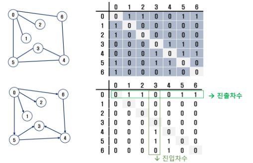
>
>   - 인접 행렬의 단점은?
>       - 많은 메모리 공간을 차지한다.
>
>           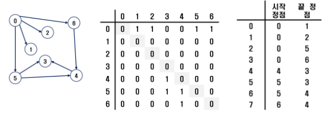
>

>**인접 리스트**
> - 각 정점에 대한 인접 정점들을 순차적으로 표현
> - 하나의 정점에 대한 인접 정점들을 각각 노드로 하는 연결 리스트로 저장
>
>   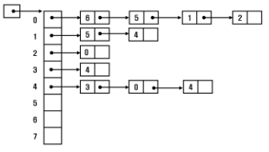
>
>   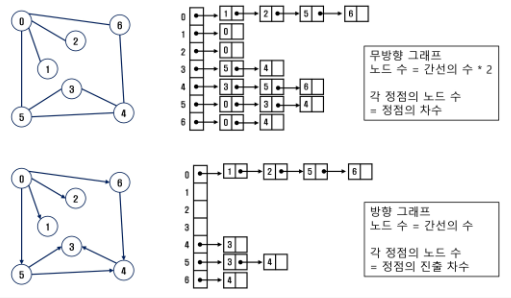
>
---
## DFS
>**문제 제시 : 친구관계**
> - 다음과 같이 친구 관계를 그래프로 표현하였다.
> - A로부터 시작해서 한 명의 친구에게만 소식을 전달, 전달 할 수 있다면 최대 몇 명의 친구가 소식을 전달 받을 수 있을까?(단 소식을 전달 받은 친구한테는 소식을 재 전달 할 수 없다.)
> - A로부터 시작해서 친구들에게 동시에 소식을 전달할 수 있다고 할 때, 가장 늦게 전달 받는 사람은 누구일까? (단 친구에게 소식을 전달하는 속도는 동일하다)
>
>   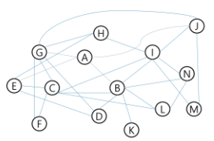
>

>**그래프 순회(탐색)**
> - 그래프 순회는 비선형구조인 그래프로 표현된 모든 자료(정점)를 빠짐없이 탐색하는 것을 의미한다.
> - 두 가지 방법
>   - 깊이 우선 탐색(Depth First Search, DFS)
>   - 너비 우선 탐색(Breadth First Search, BFS)

>**DFS(깊이우선탐색)**
> - 시작 정점의 한 방향으로 갈 수 있는 경로가 있는 곳까지 깊이 탐색해 가다가 더 이상 갈 곳이 없게 되면, 가장 마지잠에 만났던 갈림길 간선이 있는 정점으로 되돌아와서 다른 방향의 정점으로 탐색을 계속 반복하여 결국 모든 정점을 방문하는 순회방법
> - 가장 마지막에 만났던 갈림길의 정점으로 되돌아가서 다시 깊이 우선 탐색을 반복해야 하므로 후입선출 구조의 스택 사용

>**스택**
> - 스택(stack)의 특성
>   - 물건을 쌓아 올리듯 자료를 쌓아 올린 형태의 자료구조이다.
>   - 선형구조 : 자료 간의 관계가 1대1의 관계를 갖는다.
>       - 비선형 구조 : 자료 간의 관계가 1대N의 관계를 갖는다.(예: 트리)
>   - 마지막에 삽입한 자료를 가장 먼저 꺼낸다.
>       - 후입선출(LIFO, Last-In-First-Out) 이라고 부른다.

>**스택의 구현**
> - 스택을 구현하기 위해서 필요한 저장소와 연산
>   - 자료를 선형으로 저장할 저장소
>       - C언어에서는 배열을 사용할 수 있다.
>       - 저장소 자체를 스택이라 부르기도 한다.
>       - 스택에서 마지막 삽입된 원소의 위치를 top이라 부른다.
>   - 연산
>
>       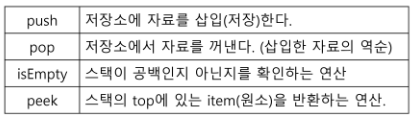
>
> - 스택의 삽입/삭제 과정
>   - 빈 스택에 원소 A, B, C를 차례로 삽입 후 한번 삭제하는 연산과정
>
>       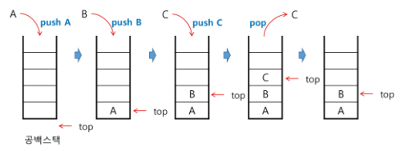
>
> - 스택의 push 알고리즘
>   - top은 스택에서 마지막 자료의 위치를 가리킨다.
>   
>   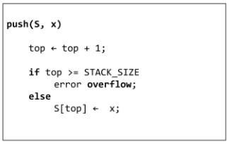
>
> - 스택의 pop 알고리즘
>
>   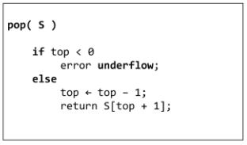
>

>**연습**
> - 스택을 구현해 봅니다.
> - 구현한 스택을 이용하여 3개의 데이터를 스택에 저장하고 다시 3번 꺼내서 출력해 봅니다.
>   ```python
>   class node:
>       def __init__(self, data, prev):
>           self.data = data
>           self.prev = prev
>   
>   
>   class stack:
>       def __init__(self):
>           self.top = None
>           self.size = 0
>   
>       def push(self, data):
>           if self.size == 0:
>               self.top = node(data, None)
>           else:
>               self.top = node(data, self.top)
>           self.size += 1
>   
>       def pop(self):
>           if self.size > 0:
>               res = self.top.data
>               self.top = self.top.prev
>               self.size -= 1
>               return res
>   
>   
>   s = stack()
>   for i in range(1, 4):
>       s.push(i*10)
>   for i in range(3):
>       print(s.pop())
>       
>   '''
>   30
>   20
>   10
>   '''
>   ```

>**DFS(Depth First Search)**
> - DFS 알고리즘 - 재귀
>
>   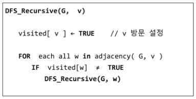
>
> - DFS 알고리즘 - 반복
>
>   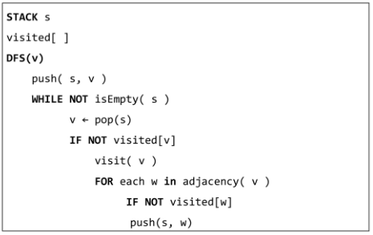
>
> - DFS 예
>
>   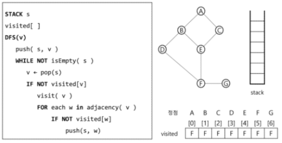
>

>**[참고] DFS(Depth First Search)**
>
>   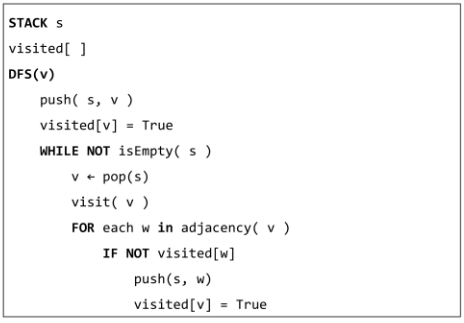
>

>**연습문제1 - DFS**
> - 다음은 연결되어 있는 두개의 정점 사이의 간선을 순서대로 나열 해 놓은 것이다. 모든 정점을 깊이 우선 탐색하여 화면에 깊이 우선 탐색 경로를 출력하시오. 시작 정점을 1로 시작하시오.
>   - 1 2 1 3 2 4 2 5 4 6 5 6 6 7 3 7
>   - 출력의 결과는 다음과 같다
>       - 1 2 4 6 5 7 3
>       - 1 3 7 6 5 2 4
>
>       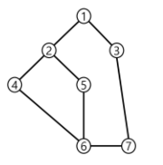
>
>   ```python
>   class node:
>       def __init__(self, data, prev):
>           self.data = data
>           self.prev = prev
>   
>   
>   class stack:
>       def __init__(self):
>           self.top = None
>           self.size = 0
>   
>       def push(self, data):
>           if self.size == 0:
>               self.top = node(data, None)
>           else:
>               self.top = node(data, self.top)
>           self.size += 1
>   
>       def pop(self):
>           if self.size > 0:
>               res = self.top.data
>               self.top = self.top.prev
>               self.size -= 1
>               return res
>   
>   
>   arr = [[]for i in range(7)]
>   visited = [False for i in range(7)]
>   list1 = list(map(int, input().split()))
>   for i in range(1, len(list1), 2):
>       arr[list1[i-1]-1].append(list1[i]-1)
>       arr[list1[i]-1].append(list1[i-1]-1)
>   
>   s = stack()
>   res = [1]
>   now = 0
>   while True:
>       visited[now] = True
>       got_next = False
>       for i in arr[now]:
>           if not visited[i]:
>               res.append(i+1)
>               visited[i] = True
>               got_next = True
>               s.push(now)
>               now = i
>               break
>       if not got_next:
>           now = s.pop()
>       if s.size == 0:
>           break
>   
>   print(*res)
>   
>   '''
>   input : 1 2 1 3 2 4 2 5 4 6 5 6 6 7 3 7
>   output : 1 2 4 6 5 7 3
>   '''
>   ```
---
## BFS
>**BFS(Breadth First Search)**
> - 너비우선탐색은 탐색 시작점의 인접한 정점들을 먼저 모두 차례로 방문한 후에, 방문했던 정점을 시작점으로 하여 다시 인접한 정점들을 차례로 방문하는 방식
> - 인접한 정점들에 대해 탐색을 한 후, 차례로 다시 너비우선탐색을 진행해야 하므로, 선입선출 형태의 자료구조인 큐를 활용함
>

>**큐**
> - 큐(Queue)의 특성
>   - 스택과 마찬가지로 삽입과 삭제의 위치가 제한적인 자료구조
>       - 큐의 뒤에서는 삽입만 하고, 큐의 앞에서는 삭제만 이루어지는 구조
>   - 큐에 삽입한 순서대로 원소가 저장되어, 가장 먼저 삽입된 원소는 가장 먼저 삭제된다.
>       - 선입선출구조(FIFO: First In First Out)
>
>       
>

>**큐의 구조 및 기본연산**
> - 큐의 선입선출 구조
>
>   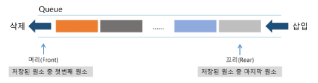
>
> - 큐의 기본 연산
>   - 삽입: enQueue
>   - 삭제: deQueue

>**큐의 연산 과정**
> 1. 공백 큐 생성 : createQueue();
> 2. 원소 A 삽입 : enQueue(A);
> 3. 원소 B 삽입 : enQueue(B);
>
>       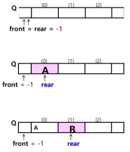
>
> 4. 원소 반환/삭제 : deQueue();
> 5. 원소 C 삽입 : enQueue(C);
> 6. 원소 반환/삭제 : deQueue();
> 7. 원소 반환/삭제 : deQueue();
>
>       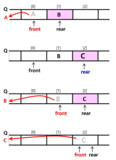
>

>**큐의 구현**
> - 삽입 : enQueue(item)
>   - 마지막 원소 뒤에 새로운 원소를 삽입하기 위해
>   1. rear 값을 하나 증가시켜 새로운 원소를 삽입할 자리를 마련
>   2. 그 인덱스에 해당하는 배열원소 Q[rear]에 item을 저장
>
>       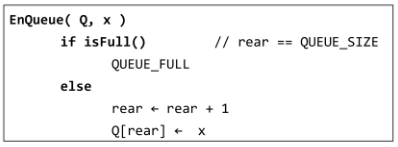
>
> - 삭제 : deQueue()
>   - 가장 앞에 있는 원소를 삭제하기 위해
>   1. front 값을 하나 증가시켜 큐에 남아있게 될 첫번째 원소 이동
>   2. 새로운 첫번째 원소를 리턴함으로써 삭제와 동일한 기능을 함
>
>       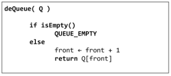
>
> - 공백상태 및 포화상태 검사 : isEmpty(). isFull()
>   - 공백상태 : front==rear
>   - 포화상태 : rear = n-1 (n:배열의 크기, n-1: 배열의 마지막 인덱스)
>
>       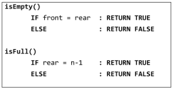
>

>**연습**
> - 큐를 구현하여 다음 동작을 확인해 봅시다.
>   - 세 개의 데이터 1, 2, 3을 차례로 큐에 삽입하고
>   - 큐에서 세 개의 데이터를 차례로 꺼내서 출력한다.
>       - 1, 2, 3이 출력 되야 함.
>   ```python
>   class node:
>       def __init__(self, data):
>           self.data = data
>           self.next = None
>   
>   
>   class queue:
>       def __init__(self):
>           self.front = None
>           self.rear = None
>           self.size = 0
>   
>       def enqueue(self, data):
>           if self.size == 0:
>               self.rear = node(data)
>               self.front = self.rear
>           else:
>               self.rear.next = node(data)
>               self.rear = self.rear.next
>           self.size += 1
>   
>       def dequeue(self):
>           if self.size > 0:
>               res = self.front.data
>               if self.size == 1:
>                   self.front = None
>                   self.rear = None
>               else:
>                   self.front = self.front.next
>               self.size -= 1
>               return res
>   
>   
>   q = queue()
>   for i in range(1, 4):
>       q.enqueue(i)
>   while q.size:
>       print(q.dequeue())
>   ```

>**BFS(Breadth First Search)**
> - BFS는 예제 그래프를 붙여진 번호 순서로 탐색함
>
>   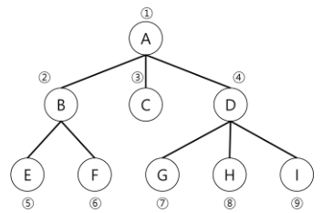
>

>**BFS 알고리즘**
> - 입력 파리미터 : 그래프 G와 탐색 시작점 v
>
>   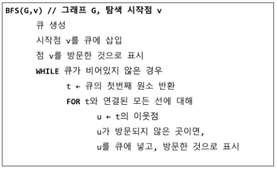
>

>**BFS 예**
>
>   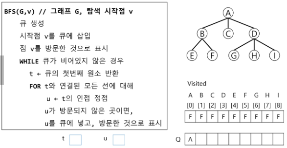
>

>**연습문제2 - BFS**
> - 다음은 연결되어 있는 두 개의 정점 사이의 간선을 순서대로 냐열 해 놓은 것이다. 모든 정점을 너비 우선 탐색하여 화면에 너비 우선탐색 경로를 출력하시오. 시작 정점을 1로 시작하시오.
>   - 1 2 1 3 2 4 2 5 4 6 5 6 6 7 3 7
>   - 출력 결과의 예는 다음과 같다
>       - 1 2 3 4 5 7 6
>
>       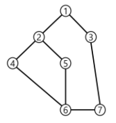
>
>   ```python
>   class node:
>       def __init__(self, data):
>           self.data = data
>           self.next = None
>   
>   
>   class queue:
>       def __init__(self):
>           self.front = None
>           self.rear = None
>           self.size = 0
>   
>       def enqueue(self, data):
>           if self.size == 0:
>               self.rear = node(data)
>               self.front = self.rear
>           else:
>               self.rear.next = node(data)
>               self.rear = self.rear.next
>           self.size += 1
>   
>       def dequeue(self):
>           if self.size > 0:
>               res = self.front.data
>               if self.size == 1:
>                   self.front = None
>                   self.rear = None
>               else:
>                   self.front = self.front.next
>               self.size -= 1
>               return res
>   
>   
>   arr = [[]for i in range(7)]
>   visited = [False for i in range(7)]
>   list1 = list(map(int, input().split()))
>   for i in range(1, len(list1), 2):
>          arr[list1[i-1]-1].append(list1[i]-1)
>          arr[list1[i]-1].append(list1[i-1]-1)
>   
>   q = queue()
>   q.enqueue(0)
>   res = [0]
>   visited[0] = True
>   while q.size:
>       now = q.dequeue()
>       for i in arr[now]:
>           if not visited[i]:
>               visited[i] = True
>               q.enqueue(i)
>               res.append(i)
>   res = map(lambda x: x+1, res)
>   print(*res)
>   ```
---
## 서로소 집합들
>**서로소 집합(Disjoint-sets)**
> - 서로소 또는 상호배타 집합들은 서로 중복 포함된 원소가 없는 집합들이다. 다시 말해 교집합이 없다.
> - 집합에 속한 하나의 특정 멤버를 통해 각 집합들을 구분한다. 이를 대표자(representative)라한다.
> - 상호배타 집합을 표현하는 방법
>   - 연결리스트
>   - 트리
> - 상호 배타 집합 연산
>   - Make-Set(x)
>   - Find-Set(x)
>   - Union(x, y)
> - 상호배타 집합 예
>
>   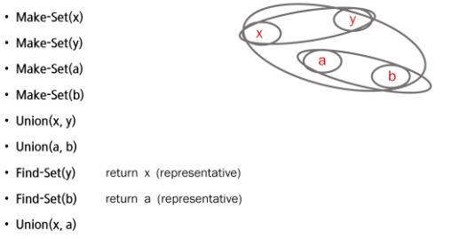
>

>**상호 배타 집합 표현 - 연결리스트**
> - 같은 집합의 원소들은 하나의 연결리스트로 관리한다.
> - 연결리스트의 맨 앞의 원소를 집합의 대표 원소로 삼는다.
> - 각 원소는 집합의 대표원소를 가리키는 링크를 갖는다.
>
>   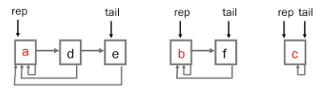
>
> - 연결리스트 연산 예
>
>   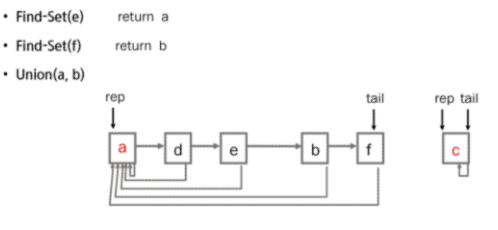
>

>**상호 배타 집합 표현- 트리**
> - 하나의 집합(a disjoint set)을 하나의 트리로 표현한다.
> - 자식 노드가 부모 노드를 가리키며 루트 노드가 대표자가 된다.
>
>   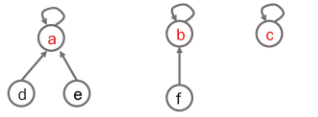
>
> - 연산 예
>
>   
>
>   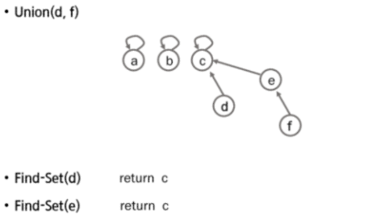
>
> - 상호 배타 집합을 표현한 트리의 배열을 이용한 저장된 모습
>
>   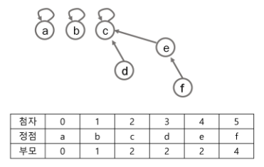
>

>**상호 배타 집합에 대한 연산**
> 1. Make-Set(x) : 유일한 멤버 x를 포함하는 새로운 집합을 생성하는 연산
> 2. Find_Set(y) : x를 포함하는 집합을 찾는 연산
> 3. Union(x, y) : x와 y를 포함하는 두 집합을 통합하는 연산
>
>       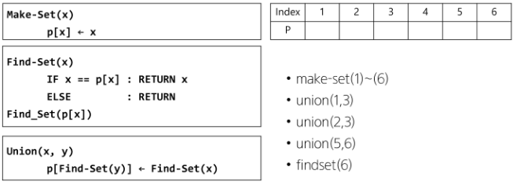
>
> - 문제점
>
>   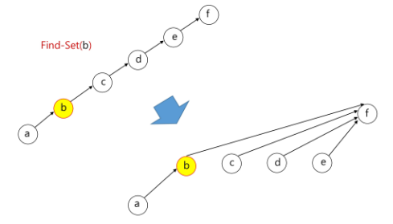
>
> - 연산의 효율을 높이는 방법
>   - Rank를 이용한 Union
>       - 각 노드는 자신을 루트로 하는 subtree의 높이를 랭크 Rank라는 이름으로 저장한다.
>       - 두 집합을 합칠 때 rank가 낮은 집합을 rank가 높은 집합에 붙인다
>   - Path compression
>       - Find-Set을 행하는 과정에서 만나는 모든 노드들이 직접 root를 가르키도록 포인터를 바꾸어 준다
>
> - 랭크를 이용한 Union의 예
>
>   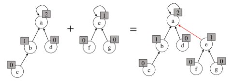
>
> - 랭크를 이용한 Uninon에서 랭크가 증가하는 예
>
>   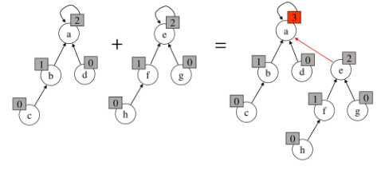
>
> - Path Compression의 예
>
>   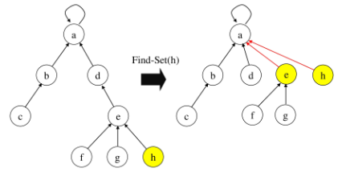
>
> - Make_Set() 연산
>   - Make_Set(x): 유일한 멤버 x를 포함하는 새로운 집합을 생성하는 연산
>
>       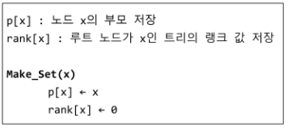
>
> - Find_Set 연산
>   - Find_Set(x): x를 포함하는 집합을 찾는 오퍼레이션
>
>       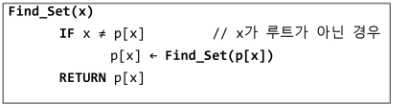
>
>   - Find_Set 연산은 특정 노드에서 루트까지의 경로를 찾아 가면서 부모 정보를 갱신한다.
> - Union 연산
>   - Union(x, y): x와 y를 포함하는 두 집합을 통합하는 오퍼레이션
>
>       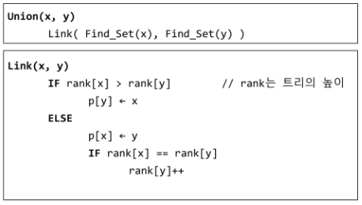
>
---
## 최소 비용 신장 트리(MST)
> **최소 신장 트리(MST)**
> - 그래프에서 최소 비용 문제
>   1. 모든 정점을 연결하는 간선들의 가중치의 합이 최소가 되는 트리
>   2. 두 정점 사이의 최소 비용의 경로 찾기
> - 신장 트리
>   - n 개의 정점으로 이루어진 무방향 그래프에서 n개의 정점과 n-1개의 간선으로 이루어진 트리
> - 최소 신장 트리(Minimum Spanning Tree)
>   - 무방향 가중치 그래프에서 신장 트리를 구성하는 간선들의 가중치의 합이 최소인 신장 트리

>**MST 표현**
>
>   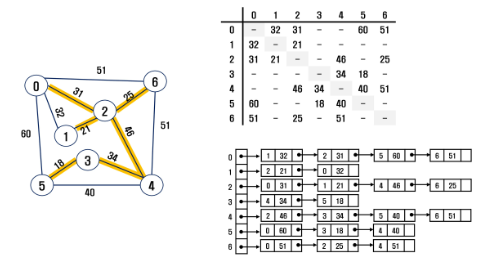
>
>   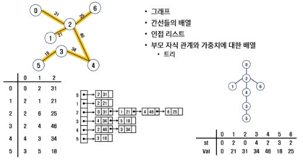
>

>**Prim 알고리즘**
> - 하나의 정점에서 연결된 간선들 중에 하나씩 선택하면서 MST를 만들어 가는 방식
>   1. 임의의 정점을 하나 선택해서 시작
>   2. 선택한 정점과 인접하는 정점들 중의 최소 비용의 간선이 존재하는 정점을 선택
>   3. 모든 정점이 선택될 때 까지 1, 2 과정을 반복
> - 서로소인 2개의 집합(2 disjoint-sets) 정보를 유지
>   - 트리 정점들(tree vertices) - MST를 만들기 위해 선택된 정점들
>   - 비트리 정점들(nontree vertices) - 선택 되지 않은 정점들
> - 알고리즘 적용 예
>   
>   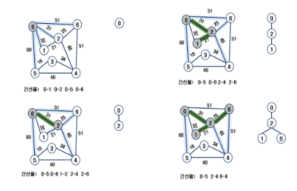
>
>   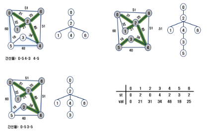
>
>   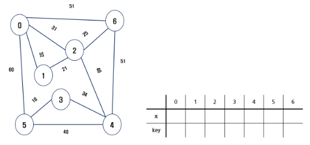
>
> - 알고리즘
>
>   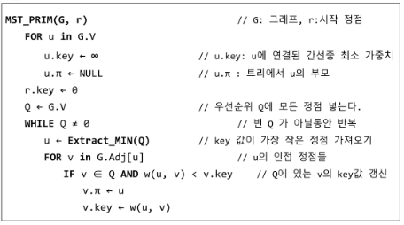
>
> - 코드
>   ```python
>   import heapq
>   
>   def prim(start):
>       heap = []
>       now = start
>       visited[start] = True
>       res = []
>       for i in range(V-1):
>           for j in range(V):
>               if graph[now][j] != 0 and not visited[j]:
>                   heapq.heappush(heap, (graph[now][j], now, j))
>   
>           while heap:
>               w, p, s = heapq.heappop(heap)
>               if not visited[s]:
>                   break
>   
>           res.append(f'{p}-{s}-{w}')
>           visited[s] = True
>           now = s
>       print(res)
>   
>   
>   V, E = map(int, input().split())
>   
>   graph = [[0]*V for i in range(V)]
>   visited = [False for i in range(V)]
>   
>   for _ in range(E):
>       v1, v2, w = map(int, input().split())
>       graph[v1][v2] = w
>       graph[v2][v1] = w
>   
>   prim(0)
>   
>   '''
>   input:
>   7 11
>   0 1 32
>   0 2 31
>   0 5 60
>   0 6 51
>   1 2 21
>   2 4 46
>   2 6 25
>   3 4 34
>   3 5 18
>   4 5 40
>   4 6 51
>   '''
>   
>   '''
>   output:
>   ['0-2-31', '2-1-21', '2-6-25', '2-4-46', '4-3-34', '3-5-18']
>   '''
>   ```

>**KRUSKAL알고리즘**
> - 간선을 하나씩 선택해서 MST를 찾는 알고리즘
>   1. 최초, 모든 간선을 가중치에 따라 오름차순으로 정렬
>   2. 가중치가 가장 낮은 간선부터 선택하면서 트리를 증가시킴.
>       - 사이클이 존재하면 다음으로 가중치가 낮은 간선 선택
>   3. n-1개의 간선이 선택될 때 까지 2를 반복
>
>       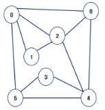
>
> - 알고리즘 적용 예
>
>   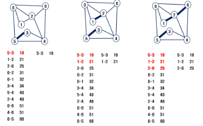
>
>   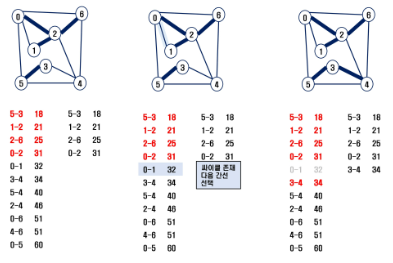
>
>   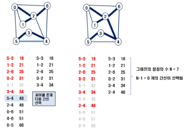
>
> - 알고리즘
>
>   
>
> - 코드
>   ```python
>   import heapq
>   
>   def find(x):
>       if parent[x] == x:
>           return x
>       else:
>           parent[x] = find(parent[x])
>           return parent[x]
>   
>   
>   def union(x, y):
>       root_x = find(x)
>       root_y = find(y)
>       if x == y:
>           return
>       if x < y:
>           parent[root_y] = root_x
>       else:
>           parent[root_x] = root_y
>   
>   
>   V, E = map(int, input().split())
>   
>   parent = [i for i in range(V)]
>   heap = []
>   res = []
>   
>   for _ in range(E):
>       v1, v2, w = map(int, input().split())
>       heapq.heappush(heap, (w, v1, v2))
>   
>   while heap:
>       w, v1, v2 = heapq.heappop(heap)
>       if find(v1) != find(v2):
>           union(v1, v2)
>           res.append(f'{v1}-{v2}-{w}')
>   
>   print(res)
>   
>   '''
>   input:
>   7 11
>   0 1 32
>   0 2 31
>   0 5 60
>   0 6 51
>   1 2 21
>   2 4 46
>   2 6 25
>   3 4 34
>   3 5 18
>   4 5 40
>   4 6 51
>   '''
>   
>   '''
>   output:
>   ['3-5-18', '1-2-21', '2-6-25', '0-2-31', '3-4-34', '2-4-46']
>   '''
>   ```
>
---
## 최단 경로
> **최단 경로**
> - 최단 경로의 정의
>   - 간선의 가중치가 있는 그래프에서 두 정점 사이의 경로들 중에 간선의 가중치 합이 최소인 경로
>
> - 하나의 시작 정점에서 끝 정점까지의 최단경로
>   - 다익스트라(dijkstra) 알고리즘
>       - 음의 가중치를 허용하지 않음
>   - 벨만-포드(Bellman-Ford) 알고리즘
>       - 음의 가중치 허용
>
> - 모든 정점들에 대한 최단 경로
>   - 플로이드-워샬(Floyd-Warshall) 알고리즘
>

>**Dijkstra 알고리즘**
> - 시작 정점에서 거리가 최소인 정점을 선택해 나가면서 최단 경로를 구하는 방식이다.
> - 시작정점(s) 에서 끝정점(t) 까지의 최단 경로에 정점 x가 존재한다.
> - 이때, 최단 경로는 s에서 x까지의 최단 경로와 x에서 t까지의 최단 경로로 구성된다.
> - 탐욕 기법을 사용한 알고리즘으로 MST의 프림 알고리즘과 유사하다.
>
>   
>
> - 알고리즘
>   
>   
>
> - 알고리즘 적용 예
>
>   
>
>   
>
>   
>
>   
>
>   
>
>   
>
>   
>
>   
>
>   
>
> - 코드
>   ```python
>   import heapq
>   INF = 99999999999
>   V, E = map(int, input().split())
>   start = int(input())
>   graph = [[INF]*V for i in range(V)]
>   for _ in range(E):
>       v1, v2, w = map(int, input().split())
>       graph[v1][v2] = w
>   for i in range(V):
>       graph[i][i] = 0
>   
>   res = [INF]*V
>   res[start] = 0
>   heap = []
>   heapq.heappush(heap, (0, start))
>   while heap:
>       d, v = heapq.heappop(heap)
>       for i in range(V):
>           if res[i] > d + graph[v][i]:
>               res[i] = d + graph[v][i]
>               heapq.heappush(heap, (res[i], i))
>   print(res)
>   
>   '''
>   input:
>   6 8
>   0
>   0 1 2
>   0 2 4
>   1 2 1
>   1 3 7
>   2 4 3
>   3 4 2
>   3 5 1
>   4 5 5
>   '''
>   
>   '''
>   output:
>   [0, 2, 3, 9, 6, 10]
>   '''
>   ```
---