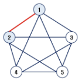
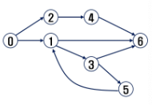

# 그래프 & 백트래킹
---
## INDEX
> **INDEX**
>   - 그래프 기본
>   - DFS
>   - BFS
>   - 서로소 집합들
>   - 최소 비용 신장 트리 (MST)
>   - 최단 경로
---
## 학습목표
> **학습목표**
> - 실 세계 문제를 그래프로 추상화해서 해결하는 방법을 학습한다.
>   - 그래프 탐색 기법인 BFS와 DFS에 대해 학습한다.
>   - 그래프 알고리즘에 활용되는 상호베타 집합(Disjoint-Set)의 자료구조에 대해 학습한다.
>   - 최소 신장 트리(Minimum Spanning Tree)를 이해하고 탐욕 기법을 이용해서 그래프에서 최소 신장 트리를 찾는 알고리즘을 학습한다.
>   - 그래프의 두 정점 사이의 최단 경로(Shortest Path)를 찾는 방법을 학습한다.
---
## 그래프 기본
> **문제 제시 : 친구 관계**
> - A의 친구는 B다.
> - C의 친구는 E, F이다.
> - (D-E), (F-G), (N-B, I, L), (G-A, C, D, H), (I-J, H), (B-D, K, L), (M-I, J), (E-A, H), (C-B, I, L), (B-I), (J-A, G)
> - A의 친구 중에서 친구가 가장 많은 친구는 누구인가?

>**그래프**
> - 그래프는 아이템 (사물 또는 추상적 개념)들과 이들 사이의 연결 관계를 표현한다.
> - 그래프는 정점(Vertex)들의 집합과 이들을 연결하는 간선(Edge)들의 집합으로 구성된 자료 구조
>   - V : 정점의 개수, E : 그래프에 포함된 간선의 개수
>   - V개의 정점을 가지는 그래프는 최대V(V-1)/2 간선이 가능
>
>      예) 5개 정점이 있는 그래프의 최대 간선수는 10(=5*4/2)개이다.
> - 선형 자료구조나 트리 자료구조로 표현하기 어려운 N : N 관계를 가지는 원소들을 표현하기에 용이하다.

> **그래프 유형**
> - 무향 그래프(Undirected Graph)
> - 유향 그래프(Directed Graph)
> - 가중치 그래프(Weighted Graph)
> - 사이클 없는 방향 그래프(DAG, Directed Acyclic Graph)
>
>   
>
> - 완전 그래프
>   - 정점들에 대해 가능한 모든 간선들을 가진 그래프
>
>       
>
> - 부분 그래프
>   - 원래 그래프에서 일부의 정점이다 간선을 제외한 그래프

> **인접 정점**
> - 두 개의 정점에 간선이 존재(연결됨)하면 서로 인접해 있다고 한다.
> - 완전 그래프에 속한 임의의 두 정점들은 모두 인접해 있다.
>
>   
>

> **그래프 경로**
> - 경로란 간선들을 순서대로 나열한 것
>   - 간선들 : (0, 2), (2, 4), (4, 6)
>   - 정점들 : 0 - 2 - 4 - 6
> - 경로 중 한 정점을 최대한 한번만 지나는 경로를 **단순경로**라 한다.
>   - 0 - 2 - 4 - 6
>   - 0 - 1 - 6
> - 시작한 정점에서 끝나는 경로를 **사이클(Cycle)**이라고 한다.
>   - 1 - 3 - 5 - 1
>
>   
