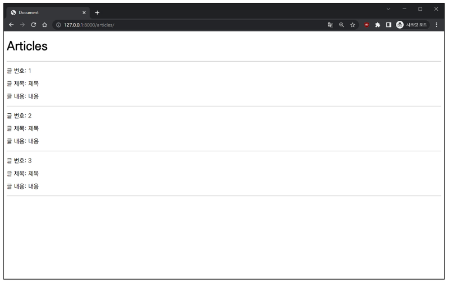
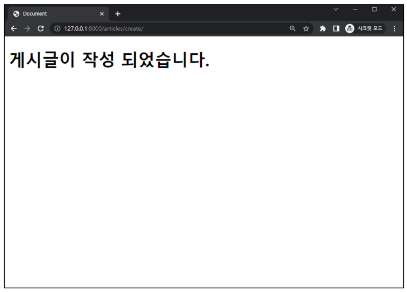

# Django ORM with view
    Django shell 에서 연습했던 QuerySet API를 직접 view 함수에서 사용하기
---
## INDEX
> **INDEX**
> 1. Read
> 2. Created
> 3. HTTP request methods
> 4. Delete
> 5. Update
---
## Read
> - 2가지 조회 진행
>   1. 전체 게시글 조회
>       
>       ```python
>       # articles/models.py
>       from django.db import models
>       
>       # Create your models here.
>       class Article(models.Model):
>           title = models.CharField(max_length=20)
>           content = models.TextField()
>           created_at = models.DateTimeField(auto_now_add=True)
>           updated_at = models.DateTimeField(auto_now=True)
>       ```
>
>       `python manage.py makemigrations`
>       
>       `python manage.py migrate`
>   
>       ```python
>       # project/urls.py
>       from django.contrib import admin
>       from django.urls import path, include
>       
>       urlpatterns = [
>           path('admin/', admin.site.urls),
>           path('articles/', include('articles.urls'))
>       ]
>       ```
>
>       ```python
>       # articles/urls.py
>       from django.urls import path
>       from . import views
>       app_name = 'articles'
>       urlpatterns = [
>           path('', views.index, name='index')
>       ]
>       ```
>
>       ```python
>       # articles/views.py
>       from django.shortcuts import render
>       from .models import Article
>       
>       # Create your views here.
>       def index(request):
>           articles = Article.objects.all()
>           context = {
>               'articles' : articles
>           }
>           return render(request, 'index.html', context)
>       ```
>
>       ```html
>       <!--templates/index.html-->
>       
>       
>           <h1>Articles</h1>
>           <hr>
>           
>               <p>글 번호 : {{article.pk}}</p>
>               <p>글 제목 : {{article.title}}</p>
>               <p>글 내용 : {{article.content}}</p>
>               <hr>
>           
>       
>       ```
>
>       
>
>   2. 단일 게시글 조회
>
>       ```python
>       # articles/urls.py
>       from django.urls import path
>       from . import views
>       app_name = 'articles'
>       urlpatterns = [
>           path('', views.index, name='index'),
>           path('<int:pk>/', views.detail, name='detail')
>       ]
>       ```
>
>       ```python
>       # articles/views.py
>       from django.shortcuts import render
>       from .models import Article
>       
>       # Create your views here.
>       def index(request):
>           articles = Article.objects.all()
>           context = {
>               'articles' : articles
>           }
>           return render(request, 'index.html', context)
>       
>       def detail(request, pk):
>           article = Article.objects.get(pk=pk)
>           context={
>               'article': article
>           }
>           return render(request, 'detail.html', context)
>       ```
>
>       ```html
>       <!--templates/detail.html-->
>       
>       
>           <h1>DETAIL</h1>
>           <h2>{{article.pk}} 번째 글</h2>
>           <hr>
>           <p>제목 : {{article.title}}</p>
>           <p>내용 : {{article.content}}</p>
>           <p>작성 시각 : {{article.created_at}}</p>
>           <p>수정 시각 : {{article.updated_at}}</p>
>           <hr>
>           <a href="">[back]</a>
>       
>       ```       
>       
>
>   - 단일 게시글 페이지 링크 작성
>
>       ```html
>       <!--templates/index.html-->
>       
>       
>           <h1>Articles</h1>
>           <hr>
>           
>               <p>글 번호 : {{article.pk}}</p>
>               <a href="">
>                   <p>글 제목 : {{article.title}}</p>
>               </a>
>               <p>글 내용 : {{article.content}}</p>
>               <hr>
>           
>       
>       ```
>
>       
>
---
## Create
> **Create**
> - Create 로직을 구현하기 위해 필요한 view 함수의 개수는?
>   - 사용자 입력 데이터를 받을 페이지를 렌더링 : **new**
>   - 사용자가 입력한 데이터를 받아 DB에 저장 : **create**
> - new 기능 구현
>
>   
>
>   ```python
>   # articles/urls.py
>   from django.urls import path
>   from . import views
>   app_name = 'articles'
>   urlpatterns = [
>       path('', views.index, name='index'),
>       path('<int:pk>/', views.detail, name='detail'),
>       path('new/', views.new, name='new'),
>   ]
>   ```
>   
>   ```python
>   # articles/views.py
>   from django.shortcuts import render
>   from .models import Article
>   
>   # Create your views here.
>   def index(request):
>       articles = Article.objects.all()
>       context = {
>           'articles' : articles
>       }
>       return render(request, 'index.html', context)
>   
>   def detail(request, pk):
>       article = Article.objects.get(pk=pk)
>       context={
>           'article': article
>       }
>       return render(request, 'detail.html', context)
>   
>   def new(request):
>       return render(request, 'new.html')
>   ```
>
>   ```html
>   <!--templates/new.html-->
>   
>   
>       <h1>NEW</h1>
>       <form action="" method='GET'>
>           <div>
>               <label for="title">Title : </label>
>                   <input type="text" id = 'title' name='title'>
>           </div>
>           <div>
>               <label for="content">Content : </label>
>                   <textarea name="content" id="content" cols="30" rows="10"></textarea>
>           </div>
>           <input type="submit" value='제출'>
>       </form>
>       <hr>
>       <a href="">[back]</a>
>   
>   ```
>
>   - new 페이지로 이동할 수 있는 하이퍼링크 작성
>
>       ```html
>       <!--templates/index.html-->
>       
>       
>           <h1>Articles</h1>
>           <a href="">NEW</a>
>           <hr>
>           
>               <p>글 번호 : {{article.pk}}</p>
>               <a href="">
>                   <p>글 제목 : {{article.title}}</p>
>               </a>
>               <p>글 내용 : {{article.content}}</p>
>               <hr>
>           
>       
>       ```
>
> - create 기능 구현
>
>   
>   
>   ```python
>   # articles/urls.py
>   from django.urls import path
>   from . import views
>   app_name = 'articles'
>   urlpatterns = [
>       path('', views.index, name='index'),
>       path('<int:pk>/', views.detail, name='detail'),
>       path('new/', views.new, name='new'),
>       path('create/', views.create, name='create')
>   ]
>   ```
>
>   ```python
>   # articles/views.py
>   from django.shortcuts import render
>   from .models import Article
>   
>   # Create your views here.
>   def index(request):
>       articles = Article.objects.all()
>       context = {
>           'articles' : articles
>       }
>       return render(request, 'index.html', context)
>   
>   def detail(request, pk):
>       article = Article.objects.get(pk=pk)
>       context={
>           'article': article
>       }
>       return render(request, 'detail.html', context)
>   
>   def new(request):
>       return render(request, 'new.html')
>   
>   def create(request):
>       title = request.GET.get('title')
>       content = request.GET.get('content')
>       article = Article(title=title, content=content)
>       article.save()
>       return render(request, 'create.html')
>   ```
>
>   ```html
>   <!--templates/create.html-->
>   
>   
>       <h1>게시글이 작성 되었습니다.</h1>
>   
>   ```
>
---
## HTTP request methods
> **HTTP request methods**
> - HTTP
>   - 네트워크 상에서 데이터를 주고 받기위한 약속
> - HTTP request methods
>   - 데이터(리소스)에 어떤 요청(행동)을 원하는지 나타내는 것
>   - **GET & POST**
> - 'GET' Method
>   - 특정 리소스를 조회하는 요청
>   - (GET으로 데이터를 전달하면 Query String 형식으로 보내짐)
>
>       `http://127.0.0.1:8000/articles/create/?title=제목&content=내용`
>
> - 'POST' Method
>   - 특정 리소스에 변경(생성, 수정 삭제)을 요구하는 요청
>   - (POST로 데이터를 전달하면 HTTP Body에 담겨 보내짐)
>   - POST method 적용
>
>       ```html
>       <!--templates/new.html-->
>       
>       
>           <h1>NEW</h1>
>           <form action="" method='POST'>
>               <div>
>                   <label for="title">Title : </label>
>                       <input type="text" id = 'title' name='title'>
>               </div>
>               <div>
>                   <label for="content">Content : </label>
>                       <textarea name="content" id="content" cols="30" rows="10"></textarea>
>               </div>
>               <input type="submit" value='제출'>
>           </form>
>           <hr>
>           <a href="">[back]</a>
>       
>       ```
>
>       ```python
>       # articles/views.py
>       from django.shortcuts import render
>       from .models import Article
>       
>       # Create your views here.
>       def index(request):
>           articles = Article.objects.all()
>           context = {
>               'articles' : articles
>           }
>           return render(request, 'index.html', context)
>       
>       def detail(request, pk):
>           article = Article.objects.get(pk=pk)
>           context={
>               'article': article
>           }
>           return render(request, 'detail.html', context)
>       
>       def new(request):
>           return render(request, 'new.html')
>       
>       def create(request):
>           title = request.POST.get('title')
>           content = request.POST.get('content')
>           article = Article(title=title, content=content)
>           article.save()
>           return render(request, 'create.html')
>       ```
>
>   - 게시글 작성 후 403 응답 확인
>
>       
> - HTTP response status code
>   - 특정 HTTP 요청이 성공적으로 완료되었는지를 3자리 숫자로 표현하기로 약속한 것
>   - https://developer.mozilla.org/en-US/docs/Web/HTTP/Status
>   - 403 Forbidden
>       - 서버에 요청이 전달되었지만, **권한** 때문에 거절되었다는 것을 의미
>   - 거절 된 이유
>       - "CSRF token이 누락되었다"
> - CSRF
>   - Cross-Site-Request-Forgery
>   - "사이트 간 요청 위조"
>   - 사용자가 자신의 의지와 무관하게 공격자가 의도한 행동을 하여 특정 웹 페이지를 보안에 취약하게 하거나 수정, 삭제 등의 작업을 하게 만드는 공격 방법
>   - CSRF Token 적용
>       - DTL의 csrf_token 태그를 사용해 사용자에게 토근 값을 부여
>       - 요청 시 토큰 값도 함께 서버로 전송될 수 있도록 함
>
>           ```html
>           <!--templates/new.html-->
>           
>           
>               <h1>NEW</h1>
>               <form action="" method='POST'>
>                   
>                   <div>
>                       <label for="title">Title : </label>
>                           <input type="text" id = 'title' name='title'>
>                   </div>
>                   <div>
>                       <label for="content">Content : </label>
>                           <textarea name="content" id="content" cols="30" rows="10"></textarea>
>                   </div>
>                   <input type="submit" value='제출'>
>               </form>
>               <hr>
>               <a href="">[back]</a>
>           
>           ```
>
>   - 요청 시 CSRF Token을 함께 보내야 하는 이유
>       - Django 서버는 해당 요청이 DB에 데이터를 하나 생성하는(DB에 영향을 주는) 요청에 대해 "Django가 직접 제공한 페이지에서 데이터를 작성하고 있는 것 인지"에 대한 확인 수단이 필요한 것
>       - 겉 모습이 똑같은 위조 사이트나 정삭적이지 않은 요청에 대한 방어 수단
>       - 기존
>           - 요청 데이터 -> 게시글 작성
>       - 변경
>           - 요쳥 데이터 + **인증토큰** -> 게시글 작성
>   - 그런데 왜 POST일 때만 Token을 확인할까?
>       - POST는 단순 조회를 위한 GET과 달리 특정 리소스에 변경(생성, 수정, 삭제)을 요구하는 의미와 기술적인 부분을 가지고 있기 때문
>       - DB에 조작을 가하는 요청은 반드시 인증 수단이 필요
>       - 데이터 베이스에 대한 변경사항을 만드는 요청이기 때문에 토큰을 사용해 최소한의 신원 확인을 하는 것
> - 게시글 작성 결과
>   - 게시글 생성 후 개발자 도구를 사용해 Form Data가 전송되는 것 확인
>   - 더 이상 URL에 데이터가 표기되지 않음
>
>   
>
---
### redirect
> **redirect**
> - 게시글 작성 후 완료를 알리는 페이지를 응답하는 것
>   - 게시글을 "조회해줘!" 라는 요청이 아닌 "작성해줘!"라는 요청이기 때문에
게시글 저장 후 페이지를 응답하는 것은 POST 요청에 대한 적절한 응답이 아님
>
>       
>
>   - 데이터 저장 후 페이지를 주는 것이 아닌 다른 페이지로 사용자를 보내야 한다.
>   - 사용자를 보낸다 == 사용자가 GET 요청을 한번 더 보대도록 해야 한다.
> - redirect()
>   - 클라이언트가 인자에 작성된 주소로 다시 요청을 보내도록 하는 함수
>   - redirect() 함수 적용
>       - create view 함수 개선
>
>           ```python
>           # articles/views.py
>           from django.shortcuts import render, redirect
>           from .models import Article
>           
>           # Create your views here.
>           def index(request):
>               articles = Article.objects.all()
>               context = {
>                   'articles' : articles
>               }
>               return render(request, 'index.html', context)
>           
>           def detail(request, pk):
>               article = Article.objects.get(pk=pk)
>               context={
>                   'article': article
>               }
>               return render(request, 'detail.html', context)
>           
>           def new(request):
>               return render(request, 'new.html')
>           
>           def create(request):
>               title = request.POST.get('title')
>               content = request.POST.get('content')
>               article = Article(title=title, content=content)
>               article.save()
>               return redirect('articles:detail', article.pk)
>           ```
>
> - redirect 특징
>   - 해당 redirect에서 클라이언트는 detail url로 요청을 다시 보내게 됨
>   - 결과적으로 detail view 함수가 호출되어 detail view 함수의 반환 결과인 detail 페이지를 응답 받음
>   - 결국 사용자는 게시글 작성 후 작성된 게시글의 detail 페이지로 이동하는 것으로 느끼게 되는 것
>
>       ```python
>       def create(request):
>           title = request.POST.get('title')
>           content = request.POST.get('content')
>           article = Article(title=title, content=content)
>           article.save()
>           return redirect('articles:detail', article.pk)
>       ```
>
> - 게시글 작성 결과
>   - 게시글 작성 후 생성 된 게시글의 detail 페이지로 redirect 되었는지 확인
>   - create 요청 이후에 detail로 다시 요청을 보냈다는 것을 알 수 있음
>
>       
>
---
## Delete
> **Delete**
> - Delete 기능 구현
>
>   
>
>   ```python
>   # articles/urls.py
>   from django.urls import path
>   from . import views
>   app_name = 'articles'
>   urlpatterns = [
>       path('', views.index, name='index'),
>       path('<int:pk>/', views.detail, name='detail'),
>       path('new/', views.new, name='new'),
>       path('create/', views.create, name='create'),
>       path('<int:pk>/delete/', views.delete, name='delete')
>   ]
>   ```
>
>   ```python
>   # articles/views.py
>   from django.shortcuts import render, redirect
>   from .models import Article
>   
>   # Create your views here.
>   def index(request):
>       articles = Article.objects.all()
>       context = {
>           'articles' : articles
>       }
>       return render(request, 'index.html', context)
>   
>   def detail(request, pk):
>       article = Article.objects.get(pk=pk)
>       context={
>           'article': article
>       }
>       return render(request, 'detail.html', context)
>   
>   def new(request):
>       return render(request, 'new.html')
>   
>   def create(request):
>       title = request.POST.get('title')
>       content = request.POST.get('content')
>       article = Article(title=title, content=content)
>       article.save()
>       return redirect('articles:detail', article.pk)
>   
>   def delete(request, pk):
>       article = Article.objects.get(pk=pk)
>       article.delete()
>       return redirect('articles:index')
>   ```
>
>   ```html
>   <!--templates/detail.html-->
>   
>   
>       <h1>DETAIL</h1>
>       <h2>{{article.pk}} 번째 글</h2>
>       <hr>
>       <p>제목 : {{article.title}}</p>
>       <p>내용 : {{article.content}}</p>
>       <p>작성 시각 : {{article.created_at}}</p>
>       <p>수정 시각 : {{article.updated_at}}</p>
>       <hr>
>       <form action="" method='POST'>
>           
>           <input type="submit" value='delete'>
>       </form>
>       <a href="">[back]</a>
>   
>   ```
>
---
## Update
> - Update 로직을 구현하기 위해 필요한 view 함수의 개수는?
>   1. 사용자 입력 데이터를 받을 페이지 렌더링 : edit
>   2. 사용자가 입력한 데이터를 받아 DB에 저장 : update
> - edit 기능 구현
>
>   
>
>   ```python
>   # articles/urls.py
>   from django.urls import path
>   from . import views
>   app_name = 'articles'
>   urlpatterns = [
>       path('', views.index, name='index'),
>       path('<int:pk>/', views.detail, name='detail'),
>       path('new/', views.new, name='new'),
>       path('create/', views.create, name='create'),
>       path('<int:pk>/delete/', views.delete, name='delete'),
>       path('<int:pk>/edit/', views.edit, name='edit'),
>   ]
>   ```
>   
>   ```python
>   # articles/views.py
>   from django.shortcuts import render, redirect
>   from .models import Article
>   
>   # Create your views here.
>   def index(request):
>       articles = Article.objects.all()
>       context = {
>           'articles' : articles
>       }
>       return render(request, 'index.html', context)
>   
>   def detail(request, pk):
>       article = Article.objects.get(pk=pk)
>       context={
>           'article': article
>       }
>       return render(request, 'detail.html', context)
>   
>   def new(request):
>       return render(request, 'new.html')
>   
>   def create(request):
>       title = request.POST.get('title')
>       content = request.POST.get('content')
>       article = Article(title=title, content=content)
>       article.save()
>       return redirect('articles:detail', article.pk)
>   
>   def delete(request, pk):
>       article = Article.objects.get(pk=pk)
>       article.delete()
>       return redirect('articles:index')
>   
>   def edit(request, pk):
>       article = Article.objects.get(pk=pk)
>       context = {
>           'article': article
>       }
>       return render(request, 'edit.html', context)
>   ```
>
>   - 수정 시 이전 데이터가 출력 될 수 있도록 작성하기
>
>       ```html
>       
>       
>           <h1>Edit</h1>
>           <form action="" method='POST'>
>               
>               <div>
>                   <label for="title">Title : </label>
>                       <input type="text" id = 'title' name='title' value='{{article.title}}'>
>               </div>
>               <div>
>                   <label for="content">Content : </label>
>                       <textarea name="content" id="content" cols="30" rows="10">{{article.content}}</textarea>
>               </div>
>               <input type="submit" value='제출'>
>           </form>
>           <hr>
>           <a href="">[back]</a>
>       
>       ```
>
>   - edit 페이지로 이동하기 위한 하이퍼링크 작성
>
>       ```html
>       <!--templates/detail.html-->
>       
>       
>           <h1>DETAIL</h1>
>           <h2>{{article.pk}} 번째 글</h2>
>           <hr>
>           <p>제목 : {{article.title}}</p>
>           <p>내용 : {{article.content}}</p>
>           <p>작성 시각 : {{article.created_at}}</p>
>           <p>수정 시각 : {{article.updated_at}}</p>
>           <hr>
>           <a href="">EDIT</a>
>           <form action="" method='POST'>
>               
>               <input type="submit" value='delete'>
>           </form>
>           <a href="">[back]</a>
>       
>       ```
>
> - update 기능 구현
>
>   ```python
>   # articles/urls.py
>   from django.urls import path
>   from . import views
>   app_name = 'articles'
>   urlpatterns = [
>       path('', views.index, name='index'),
>       path('<int:pk>/', views.detail, name='detail'),
>       path('new/', views.new, name='new'),
>       path('create/', views.create, name='create'),
>       path('<int:pk>/delete/', views.delete, name='delete'),
>       path('<int:pk>/edit/', views.edit, name='edit'),
>       path('<int:pk>/update/', views.update, name='update')
>   ]
>   ```
>   
>   ```python
>   # articles/views.py
>   from django.shortcuts import render, redirect
>   from .models import Article
>   
>   # Create your views here.
>   def index(request):
>       articles = Article.objects.all()
>       context = {
>           'articles' : articles
>       }
>       return render(request, 'index.html', context)
>   
>   def detail(request, pk):
>       article = Article.objects.get(pk=pk)
>       context={
>           'article': article
>       }
>       return render(request, 'detail.html', context)
>   
>   def new(request):
>       return render(request, 'new.html')
>   
>   def create(request):
>       title = request.POST.get('title')
>       content = request.POST.get('content')
>       article = Article(title=title, content=content)
>       article.save()
>       return redirect('articles:detail', article.pk)
>   
>   def delete(request, pk):
>       article = Article.objects.get(pk=pk)
>       article.delete()
>       return redirect('articles:index')
>   
>   def edit(request, pk):
>       article = Article.objects.get(pk=pk)
>       context = {
>           'article': article
>       }
>       return render(request, 'edit.html', context)
>   
>   def update(request, pk):
>       title = request.POST.get('title')
>       content = request.POST.get('content')
>       article = Article.objects.get(pk=pk)
>       article.title = title
>       article.content = content
>       article.save()
>       return redirect('articles:detail', pk)
>   ```
>
>   - 작성 후 게시를 수정 테스트
>
---
## 참고
> - HTTP request methods 사용 예시
>   - TMDB API
>
>       
>
> - HTTP request methods를 활용한 효율적인 URL 구성
>   - 동일한 URL이지만 method에 따라 서버에 요구하는 행동을 다르게 요구
>   - Django 후반기 REST API 시간에 다룰 예정
>
>       
>
---