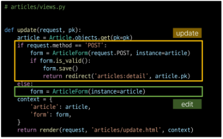

# Django Form
## INDEX
> **INDEX**
>   1. 개요
>   2. Django Form
>   3. Django ModelForm
>   4. Handling HTTP requests
---
## 개요
> - HTML 'form'
>   - 지금까지 사용자로부터 데이터를 받기위해 활용한 방법
>   - 그러나 비정상적 혹은 악의적인 요청을 필터링 할 수 없음
>   - 유효한 데이터인지에 대한 확인이 필요
> - 유효성 검사
>   - 수집한 데이터가 정확하고 유효한지 확인하는 과정
> - 유효성 검사 구현
>   - 유효성 검사를 구현하기 위해서는 입력 값, 형식, 중복, 범위, 보안 등 많은 것들을 고려해야 함
>   - 이런 과정과 기능을 직접 개발하는 것이 아닌 Django가 제공하는 Form을 사용
---
## Django Form
### Form class
> - Django Form
>   - 사용자 입력 데이터를 수집하고,
>   - 처리 및 유효성 검사를 수행하기 위한 도구
>   - 유효성 검사를 단순화하고 자동화 할 수 있는 기능을 제공
> - Form class 정의
>
>   
>
> - Form class를 적용한 new 로직
>
>   
>
>   
>
>   
>
> - Form rendering options
>   - label, input 쌍을 특정 HTML 태그로 감싸는 옵션
>   - https://docs.djangoproject.com/en/4.2/topics/form/#form-rendering-options
>
>   
>
>   
>
---
### widgets
> - Widgets
>   - HTML 'input' element의 표현 담장
> - Widgets 사용
>   - Widget은 단순히 input 요소의 속성 및 출력되는 부분을 변경하는 것
>   - https://docs.djangoproject.com/ko/4.2/ref/forms/widgets/#built-in-widgets
>
>   
>
---
## Django ModelForm
> - Form vs ModelForm
>   - Form
>       - 사용자 입력 데이터를 DB에 저장하지 않을 때 (ex. 로그인)
>   - ModelForm
>       - 사용자 입력 데이터를 DB에 저장해야 할 때 (ex. 게시글, 회원가입)
> - ModelForm
>   - Model과 연결된 Form을 자동으로 생성해주는 기능을 제공
>   - Form + Model
> - ModelForm class 정의
>   - 기존 ArticleForm 클래스 수정
>
>       
>
> - ModelForm class 적용
>
>   
>
> - Meta class
>   - ModelForm의 정보를 작성하는 곳
> - 'fields' 및 'exclude'속성
>   - exclude 속성을 사용하여 모델에서 포함하지 않을 필드를 지정할 수도 있음
>
>       
>
> - ModelForm을 적용한 create 로직
>
>   
>
>   - 제목 input에 공백을 입력 후 에러 메시지 출력 확인 (유효성 검사의 결과)
>
>       
>
> - is_valid()
>   - 여러 유효성 검사를 실행하고,
>   - 데이터가 유효한지 여부를 Boolean으로 반환
> - 공백 데이터가 유효하지 않은 이유와 에러메시지가 출력되는 과정
>
>   
>
> - ModelForm을 적용한 edit 로직
>
>   
>
> - ModelForm을 적용한 update 로직
>
>   
>
> - save()
>   - 데이터베이스 객체를 만들고 저장
> - save() 메서드가 생성과 수정을 구분하는 법
>   - 키워드 인자 instance 여부를 통해 생성할 지, 수정할 지를 결정
>
>       
>
> - Django Form 정리
>   - "사용자로부터 데이터를 수집하고 처리하기 위한 강력하고 유연한 도구"
>   - HTML form의 생성, 데이터 유효성 검사 및 처리를 쉽게 할 수 있도록 도움
---
## 참고
> - ModelForm 키워드 인자 data와 instance 살펴보기
>   - https://github.com/django/django/blob/main/django/forms/models.py#L341
> - Widget 응용
>
>   
>
>   
>
---
## Handling HTTP requests
### view 함수 구조 변화
> - new & create view 함수가 공통점과 차이점
>   - 공통점
>       - "데이터 생성을 구현하기 위함"
>   - 차이점
>       - "new는 GET method 요청만을,
>       - create는 POST method 요청만을 처리"
>
> - **HTTP request method 차이점을 활용해 view 함수 구조 변경**
>   - new & create 함수 결합
>
>       
>
> - 새로운 create view 함수
>   - new와 create view 함수의 공통점과 차이점을 기반으로 하나의 함수로 결합
>   - 두 함수의 유일한 차이점이었던 request mothod에 따른 분기
>   - POST 일 때는 과거 create 함수 구조였던 객체 생성 및 저장 로직 처리
>   - POST가 아닐 때는 과거 단순히 form 인스턴스 생성
>   - context에 담기는 form은
>       1. is_valid를 통과하지 못해 에러메시지를 담은 form이거나
>       2. else 문을 통한 form 인스턴스
>
>   
>
> - 기존 new 관련 코드 수정
>   - 사용하지 않는 new url 제거
>
>       
>
>   - new url을 create url로 변경
>
>       
>
>   - new 템플릿을 create 템플릿으로 변경
>
>       
>
> - request method에 따른 요청의 변화
>
>   
>
> - 새로운 update view 함수
>   - 기존 edit과 update view 함수 결합
>       
>
> - 기존 edit 관련 코드 수정
>   - 사용하지 않는 edit url 제거
>
>       
>
>   - edit 템플릿을 update 템플릿으로 변경
>
>       
>
---
