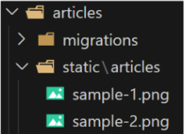
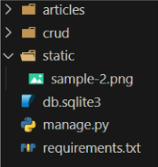

# Django Static files

## INDEX
> 1. static files
>       - Static files 제공하기
> 2. Media files
>       - 이미지 업로드
>       - 업로드 이미지 제공
---
## static files
> - Static Files : 정적 파일
>   - 서버 측에서 변경되지 않고 고정적으로 제공되는 파일
>   - (이미지, JS, CSS 파일 등)
> - 웹 서버와 정적 파일
>   - 웹서버의 기본 동작은
>   - 특정 위치(URL)에 있는 자원을 요청(HTTP request) 받아서 
>   - 응답(HTTP response)을 처리하고 제공(serving)하는 것
>   - 이는 "자원에 접근 가능한 주소가 있다." 라는 의미
>   - 웹 서버는 요청 받은 URL로 서버에 존재하는 정적 자원을 제공함
>   - 정적 파일을 제공하기 위한 경로(URL) 가 있어야 함
>
>       
>
---
### Static files 제공하기
> - Static files 제공하기
>   1. 기본 경로에서 제공하기
>   2. 추가 경로에서 제공하기
> - Static files 기본 경로
>   - app폴더/static/
> - 기본 경로 static file 제공하기
>   - articles/static/articles/ 경로에 이미지 파일 배치
>   - static tag를 사용해 이미지 파일에 대한 url 제공
>   - STATIC_URL 확인(http://127.0.0.1:8000/static/articles/sample-1/png)
>      
>       
>      
>       ```html
>       <!--articles/templates/articles/index.html-->
>
>       
>
>         
>       ```
>      
>       
>
> - STATIC_URL
>   - 기본 경로 및 추가 경로에 위치한 정적 파일을 참조하기 위한 URL 실제 파일이나 디렉토리가 아니며, URL로만 존재
>
>       ```python
>       # setting.py
>       
>       STATIC_URL = 'static/'
>       ```
>
>       
>
> - Static files 추가 경로
>   - STATICFILES_DIRS에 문자열 값으로 추가 경로 설정
> - STATICFILES_DIRS
>   - 정적 파일의 기본 경로 외에 추가적인 경로 목록을 정의하는 리스트
> - 추가 경로 static file 제공하기
>   - 임의의 추가 경로 설정
>   - 추가 경로에 이미지 파일 배치
>   - static tag를 사용해 이미지 파일에 대한 url 제공
>   - 이미지 출력 및 경로 확인
>
>       ```python
>       # setting.py
>       
>       STATIC_URL = 'static/'
>       
>       STATICFILES_DIRS = [
>           BASE_DIR / 'static',
>       ]
>       ```
>
>       
>
>       ```html
>       <!--articles/templates/articles/index.html-->
>
>       
>
>         
>         
>       ```
>
>    "정적 파일을 제공하려면 요청에 응답하기 위한 URL이 필요"
>
---
## Media files
> - Media Files
>   - 사용자가 웹에서 업로드하는 정적 파일
(user-uploaded)
---
### 이미지 업로드
> - ImageField()
>   - 이미지 업로드에 사용하는 모델 필드
>   - 이미지 객체가 직접 저장되는 것이 아닌 '이미지 파일의 경로'가 문자열로 DB에 저장
>
> - 미디어 파일을 제공하기 전 준비
>   1. setting.py에 **MEDIA_ROOT**, **MEDIA-URL** 설정
>   2. 작성한 MEDIA_ROOT와 MEDIA_URL에 대한 url지정
>
> - MEDIA_ROOT
>   - 미디어 파일들이 위치하는 디렉토리의 절대 경로
>   ```python
>   # settings.py
>
>   MEDIA_ROOT = BASE_DIR/ 'media'
>   ```
>
> - MEDIA_URL
>   - MEDIA_ROOT에서 제공되는 미디어 파일에 대한 주소를 생성
>   - (STATIC_URL과 동일한 역할)
>
>   ```python
>   # settings.py
>
>   MEDIA_ROOT = BASE_DIR/ 'media'
>   MEDIA_URL = 'media/'
>   ```
> - MEDIA_ROOT와 MEDIA_URL에 대한 url 지정
>   - 업로드 된 파일의 URL == settings.MEDIA_URL
>   - 위 URL을 통해 참조하는 파일의 실제 위치 == settings.MEDIA_ROOT
>   ```python
>   # crud/urls.py
>   from django.contrib import admin
>   from django.urls import path, include
>   from django.conf import settings
>   from django.conf.urls.static import static
>   
>   
>   urlpatterns = [
>       path('admin/', admin.site.urls),
>       path('articles/', include('articles.urls')),
>   ] + static(settings.MEDIA_URL, document_root=settings.MEDIA_ROOT)
>   ```
> - 이미지 업로드
>   - blank = True 속성을 작성해 빈 문자열이 저장될 수 있도록 제약 조건 설정
>       ```python
>       # articles/models.py
>       from django.db import models
>       
>       # Create your models here.
>       class Article(models.Model):
>           title = models.CharField(max_length=10)
>           content = models.TextField()
>           image = models.ImageField(blank=True, upload_to='%Y/%m/%d/')
>           created_at = models.DateTimeField(auto_now_add=True)
>           updated_at = models.DateTimeField(auto_now=True)
>       ```
>       - 기존 필드 사이에 작성해도 실제 테이블 생성 시에는 가장 우측(뒤)에 추가됨
>   - migration 진행
>       ```shell
>       $ pip install pillow
>       $ pip freeze > requirements.txt
>       $ python manage.py makemigrations
>       $ python manage.py migrate
>       ```
>       - Image Field를 사용하려면 반드시 pillow 라이브러리가 필요
>   - form 요소의 enctype 속성 추가
>       - `enctype="multipart/form-data"`
>
>       ```html
>       <!--articles/templates/articles/create.html-->
>       <h1>CREATE</h1>
>         <form action="" method="POST" enctype="multipart/form-data">
>           
>           {{ form.as_p }}
>           <input type="submit">
>         </form>
>       ```
>   - view 함수에서 업로드 파일에 대한 추가 코드 작성
>       - `request.FILES`
>   
>       ```python
>       # articles/views.py
>       from django.shortcuts import render, redirect
>       from .models import Article
>       from .forms import ArticleForm
>       
>       def create(request):
>           if request.method == 'POST':
>               form = ArticleForm(request.POST, request.FILES)
>               if form.is_valid():
>                   article = form.save()
>                   return redirect('articles:detail', article.pk)
>           else:
>               form = ArticleForm()
>           context = {
>               'form': form,
>           }
>           return render(request, 'articles/create.html', context)
>       ```
>   - 이미지 업로드 입력 양식 확인
>   
>   - 이미지 업로드 결과 확인(DB)
>       - DB에는 파일 자체가 아닌 "파일 경로"가 저장
>
---
### 업로드 이미지 제공
> - 업로드 이미지 제공하기
>   - 'url' 속성을 통해 업로드 파일의 경로 값을 얻을 수 있음
>   - article.image.url
>       - 업로드 파일의 경로
>   - article.image
>       - 업로드 파일의 파일 이름
>
>       ```html
>       <!--articles/templates/articles/detail.html-->
>       
>           
>       ```
>   - 업로드 이미지 출력 확인 및 MEDIA_URL 확인
>
>   - 이미지를 업로드 하지 않은 게시물은 detail 템플릿을 렌더링 할 수 없음
>   - 이미지 데이터가 있는 경우만 이미지를 출력할 수 있도록 처리
>       ```html
>       <!--articles/templates/articles/detail.html-->
>       
>       
>           
>       
>       ```
>
> - 업로드 이미지 수정
>   - 수정 페이지 form 오소에 enctype 속성 추가
>       ```html
>       <!--articles/templates/articles/update.html-->
>       <h1>Update</h1>
>       <form action="" method="POST" enctype="multipart/form-data">
>         
>         {{ form.as_p }}
>         <input type="submit">
>       </form>
>       ```
>   - update view 함수에서 업로드 파일에 대한 추가 코드 작성
>       ```python
>       # articles/views.py
>       def update(request, pk):
>           article = Article.objects.get(pk=pk)
>           if request.method == 'POST':
>               form = ArticleForm(request.POST, request.FILES, instance=article)
>           ...
>       ```
>
---
## 참고
> - 'upload_to' argument
>   - ImageField()의 upload_to 인자를 사용해 미디어 파일 추가 경로 설정
>       ```python
>       # 1
>       image = models.ImageField(blank=True, upload_to='%Y/%m/%d/')
>       
>       # 2
>       image = models.ImageField(blank=True, upload_to='images/')
>       
>       # 3
>       def articles_image_path(instance, filename):
>           return f'images/{instance.user.username}/{filename}'
>       
>       image = models.ImageField(blank=True, uplaod_to=articles_image_path)
>       ```
> - request.FILES가 두 번째 위치 인자인 이유
>   - ModelForm 상위 클래스 BaseModelForm의 생성자 함수 키워드 인자
>       ```python
>       class BaseModelForm(BaseForm):
>           def __init__(
>               self,
>               data = None,
>               files = None,
>               auto_idx = "idx_%s"
>               prefix = None,
>               initial = None,
>               ...
>       
>           ):
>       ```