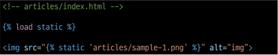

# Django Static files

## INDEX
> 1. static files
>       - Static files 제공하기
> 2. Media files
>       - 이미지 업로드
>       - 업로드 이미지 제공
---
## static files
> - Static Files : 정적 파일
>   - 서버 측에서 변경되지 않고 고정적으로 제공되는 파일
>   - (이미지, JS, CSS 파일 등)
> - 웹 서버와 정적 파일
>   - 웹서버의 기본 동작은
>   - 특정 위치(URL)에 있는 자원을 요청(HTTP request) 받아서 
>   - 응답(HTTP response)을 처리하고 제공(serving)하는 것
>   - 이는 "자원에 접근 가능한 주소가 있다." 라는 의미
>   - 웹 서버는 요청 받은 URL로 서버에 존재하는 정적 자원을 제공함
>   - 정적 파일을 제공하기 위한 경로(URL) 가 있어야 함
>
>       
>
---
### Static files 제공하기
> - Static files 제공하기
>   1. 기본 경로에서 제공하기
>   2. 추가 경로에서 제공하기
> - Static files 기본 경로
>   - app폴더/static/
> - 기본 경로 static file 제공하기
>   - articles/static/articles/ 경로에 이미지 파일 배치
>   - static tag를 사용해 이미지 파일에 대한 url 제공
>   - STATIC_URL 확인(http://127.0.0.1:8000/static/articles/sample-1/png)
>      
>       
>      
>       
>      
>       
>
> - STATIC_URL
>   - 기본 경로 및 추가 경로에 위치한 정적 파일을 참조하기 위한 URL 실제 파일이나 디렉토리가 아니며, URL로만 존재
>
>       
>
>       
>
> - Static files 추가 경로
>   - STATICFILES_DIRS에 문자열 값으로 추가 경로 설정
> - STATICFILES_DIRS
>   - 정적 파일의 기본 경로 외에 추가적인 경로 목록을 정의하는 리스트
> - 추가 경로 static file 제공하기
>   - 임의의 추가 경로 설정
>   - 추가 경로에 이미지 파일 배치
>   - static tag를 사용해 이미지 파일에 대한 url 제공
>   - 이미지 출력 및 경로 확인
>
>       
>
>
>       